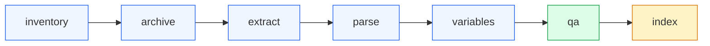

# 🛠️ CLI Data Pipeline Walkthrough

The `rkb-rs` data pipeline transforms live, unstructured public CMS documentation into structured, citation-preserving datasets and search indexes.

---

## 🏗️ Pipeline Stages Overview



---

## 1. Discovery & Inventory (`rkb inventory`)

The `inventory` command crawls the ResDAC website starting from the base dataset catalog. It classifies links into categories (`Listing`, `Dataset`, `Asset`, `Unknown`), records depth distance, and outputs a checklist.

```bash
rkb inventory \
  --base-url https://resdac.org/cms-data \
  --max-pages 20 \
  --request-delay-seconds 0.5 \
  --output manifests/site_inventory.csv
```

### Options:
- `--base-url <URL>`: Root starting URL (Default: `https://resdac.org/cms-data`).
- `--max-pages <NUMBER>`: Maximum search/listing pages to crawl.
- `--output <PATH>`: Output CSV file (Default: `manifests/site_inventory.csv`).
- `--request-delay-seconds <SECONDS>`: Delay between requests (Default: `0.5`).

---

## 2. Document Archival & Preservation (`rkb archive`)

The `archive` command downloads all files discovered in the inventory to disk, computes a cryptographic SHA-256 hash for each file, and records an archival manifest.

```bash
rkb archive \
  --inventory manifests/site_inventory.csv \
  --raw-root data/raw \
  --max-downloads 50 \
  --retry-failed-only
```

### Polite Rate Limiting & Backoff:
- Automatic backoff on HTTP 429 ("Too Many Requests").
- `--max-consecutive-rate-limits <NUMBER>`: Halts execution gracefully if consecutive 429s exceed threshold (Default: `5`).
- `--retry-failed-only`: Resumes previously interrupted downloads without re-downloading existing verified files.

---

## 3. Metadata Extraction (`rkb extract`)

The `extract` command scrapes structural relationships from archived HTML pages:

```bash
rkb extract \
  --archive-manifest manifests/archive_manifest.csv \
  --metadata-dir data/metadata \
  --graph-dir data/graph
```

### Outputs Generated:
- `data/metadata/datasets.csv`: CMS datasets, files, and category mappings.
- `data/metadata/documents.csv`: Documentation guides and technical manuals.
- `data/graph/document_edges.csv`: Parent-child dataset-to-document relationships.
- `data/graph/ontology_nodes.csv` & `ontology_edges.csv`: Conceptual ontology hierarchy.

---

## 4. Text Extraction & Sliding-Window Chunking (`rkb parse`)

The `parse` command opens raw files and extracts clean plain text:
- **HTML**: Strips boilerplate headers, navigation, footers, and scripts using `scraper`.
- **PDF**: Extracts page-by-page text using `pdf-extract`.
- **XLSX**: Parses data dictionary worksheets and cell tables using OpenXML XML streams.

```bash
rkb parse \
  --chunk-size 500 \
  --chunk-overlap 100 \
  --chunks-jsonl data/parsed/chunks.jsonl
```

### Chunker Mechanics:
Text is partitioned into overlapping windows aligned to natural word boundaries. Each chunk receives a stable deterministic ID (e.g., `chunk_10charhash_seq001`) and records exact word count and source document metadata.

---

## 5. Variable Definition Cataloging (`rkb variables`)

The `variables` command analyzes parsed chunks and archived variable definition pages:

```bash
rkb variables \
  --chunks-jsonl data/parsed/chunks.jsonl \
  --metadata-dir data/metadata \
  --graph-dir data/graph
```

### Outputs:
- `data/metadata/variables.csv`: Discovered variable records with definitions and aliases.
- `data/metadata/canonical_variables.csv`: Deduplicated canonical variable names.
- `data/graph/variable_edges.csv`: Cross-variable references.
- `data/graph/data_source_variable_edges.csv`: Dataset variable presence mappings.

---

## 6. Automated Provenance QA (`rkb qa`)

The `qa` command performs strict automated validation across all generated artifacts:

```bash
rkb qa
```

It validates:
- File existence and SHA-256 integrity checks.
- Foreign key referential integrity between CSVs and JSONL streams.
- Missing URL or chunk lineage.
- Outputs a Markdown report to `_workspace/06_qa_review.md` and returns an exit code based on the verdict (`PASS`, `FIX`, or `REDO`).

---

## 7. Progress Monitoring (`rkb progress`)

To inspect progress logs from long-running inventory or archive operations:

```bash
rkb progress
rkb progress --json
```
