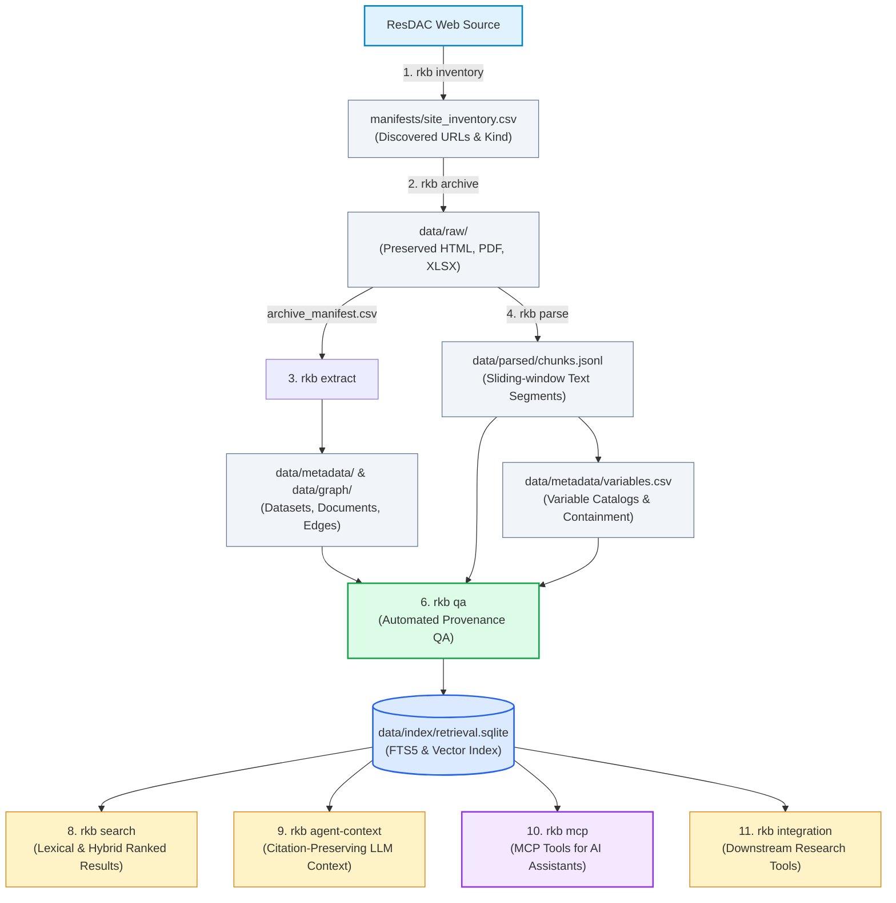

# 📚 rkb-rs Documentation Portal

Welcome to the official documentation and user manuals for **rkb-rs**, a high-performance, test-driven Rust toolkit for archiving, parsing, indexing, and retrieving **ResDAC (Research Data Assistance Center)** and **CMS (Centers for Medicare & Medicaid Services)** documentation.

`rkb-rs` is designed for health economists, epidemiological researchers, data engineers, and AI agents who need a verifiable, local, citation-backed knowledge base derived from public health documentation.

---

## ⚡ Quickstart: Zero to Search in 60 Seconds

`rkb-rs` installs a single standalone binary (`rkb`) that runs locally on macOS, Linux, and Windows without external database servers or cloud accounts:

```bash
# 1. Install via Cargo
cargo install rkb-rs

# 2. Or install via Homebrew (macOS / Linux)
brew install SaehwanPark/tap/rkb-rs

# 3. Verify installation
rkb --version
rkb --help
```

Build a local knowledge base in 5 simple commands:

```bash
# Discover pages -> Archive raw documents -> Extract metadata -> Parse text chunks -> Build search index
rkb inventory --max-pages 5
rkb archive --max-downloads 10
rkb extract
rkb parse
rkb index

# Search your local documentation with instant citation tracking!
rkb search --query "BENE_ID"
```

---

## 🧭 Documentation Map

<div class="grid-container">
  <div class="card">
    <div class="card-title">🚀 <a href="{{ '/guides/installation.html' | relative_url }}">Installation & Setup</a></div>
    <div class="card-desc">Detailed setup guides for crates.io, Homebrew tap, source compilation, shell completion, and multi-platform support.</div>
  </div>
  <div class="card">
    <div class="card-title">⚡ <a href="{{ '/guides/quickstart.html' | relative_url }}">5-Minute Quickstart</a></div>
    <div class="card-desc">A guided tutorial taking you from zero to a fully indexed, searchable local documentation database.</div>
  </div>
  <div class="card">
    <div class="card-title">🛠️ <a href="{{ '/guides/cli-pipeline.html' | relative_url }}">CLI Data Pipeline</a></div>
    <div class="card-desc">Deep dive into data acquisition: web crawling, respectful rate limiting, HTML/PDF/XLSX text parsing, and QA verification.</div>
  </div>
  <div class="card">
    <div class="card-title">🔍 <a href="{{ '/guides/search-and-agent-context.html' | relative_url }}">Search & Agent Context</a></div>
    <div class="card-desc">Lexical SQLite FTS5 search, hybrid retrieval with local embedding tables, and citation formatting for LLM prompt contexts.</div>
  </div>
  <div class="card">
    <div class="card-title">🤖 <a href="{{ '/guides/mcp-integration.html' | relative_url }}">MCP Server Integration</a></div>
    <div class="card-desc">Connect rkb-rs to Claude Desktop, Claude Code, Antigravity, and Codex via the Model Context Protocol (stdio JSON-RPC).</div>
  </div>
  <div class="card">
    <div class="card-title">📊 <a href="{{ '/guides/integration-and-eval.html' | relative_url }}">Downstream & Evaluation</a></div>
    <div class="card-desc">Dataset availability checks, variable crosswalks, cohort dictionary generators, code caveat scans, and benchmark evaluation.</div>
  </div>
  <div class="card">
    <div class="card-title">📖 <a href="{{ '/reference/cli-reference.html' | relative_url }}">CLI Command Reference</a></div>
    <div class="card-desc">Complete, exhaustive reference of all 14 rkb subcommands, arguments, default parameters, and exit codes.</div>
  </div>
  <div class="card">
    <div class="card-title">🗂️ <a href="{{ '/reference/data-schemas.html' | relative_url }}">Data Artifacts & Schemas</a></div>
    <div class="card-desc">Formal specification of CSV, JSON, and JSONL schemas produced across all pipeline stages.</div>
  </div>
  <div class="card">
    <div class="card-title">🏗️ <a href="{{ '/reference/architecture.html' | relative_url }}">Architecture & Invariants</a></div>
    <div class="card-desc">Functional-first Rust design, deterministic data transformations, and strict provenance preservation rules.</div>
  </div>
  <div class="card">
    <div class="card-title">🏷️ <a href="{{ '/reference/glossary.html' | relative_url }}">Terminology Glossary</a></div>
    <div class="card-desc">Plain-language definitions for Medicare/Medicaid data files, ResDAC terminology, and search concepts.</div>
  </div>
  <div class="card">
    <div class="card-title">🛟 <a href="{{ '/guides/troubleshooting.html' | relative_url }}">Troubleshooting Guide</a></div>
    <div class="card-desc">Solutions for HTTP 429 rate limits, CLI argument positioning, index rebuilds, and filesystem permissions.</div>
  </div>
  <div class="card">
    <div class="card-title">🔢 <a href="{{ '/reference/release-runbook.html' | relative_url }}">Release Runbook</a></div>
    <div class="card-desc">Packaging procedures, cargo-dist configuration, crates.io publication, and Homebrew tap maintenance.</div>
  </div>
</div>

---

## 🔄 End-to-End System Architecture

`rkb-rs` operates as a sequential, provenance-preserving pipeline:



---

## 🔒 Core Invariants & Guarantees

> [!IMPORTANT]
> **Public Documentation Only**
> `rkb-rs` is exclusively designed for public ResDAC and CMS metadata, documentation guides, and data dictionaries. It **never** accesses, stores, or handles CMS restricted data, claims files, personally identifiable information (PII), or protected health information (PHI).

- **Strict Provenance**: Every extracted variable, document chunk, and search match retains a direct lineage back to its source URL, file path, download timestamp, and cryptographic SHA-256 hash.
- **Hermetic & Deterministic**: Core parsing, text chunking, and metadata extraction algorithms are pure and deterministic without hidden network side effects.
- **Polite Network Preservation**: Built-in adaptive rate limiting (with configurable delays, HTTP 429 exponential backoffs, and circuit breakers) protects public servers during document preservation.
- **Rebuildable Serving Index**: CSV and JSONL files remain the canonical source of truth; SQLite is a rebuildable, throwaway serving artifact.
